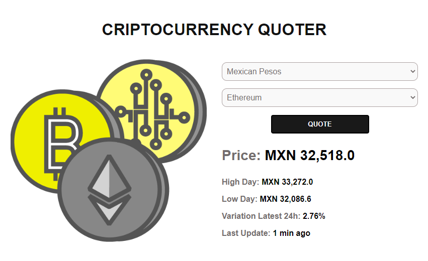

#   Cotizador de Criptomonedas

##  Consumiendo la API [Cryptocompare](https://min-api.cryptocompare.com/documentation)

En este ejemplo se esta haciendo uso de ECMA6 consuminedo una API de Criptomonedas con Javascript puro.

**Execute Call** en las 2 JSON

[Recuperando los datos de las criptomonedas](https://min-api.cryptocompare.com/documentation?key=Price&cat=multipleSymbolsFullPriceEndpoint)

[Recuperando el valor de las criptomonedas mas populares](https://min-api.cryptocompare.com/documentation?key=Toplists&cat=TopTotalMktCapEndpointFull)

**[Demo](https://cotizador-cript0.netlify.app/)**

    

